In this section a set of famous phenomena in optomechanics is presented. These calculations serve first as examples of using IOpy in simulating Langevin equations, and second are benchmarks of IOpy by comparing it to known theoretical models.

# Simple Cavity 

<!--
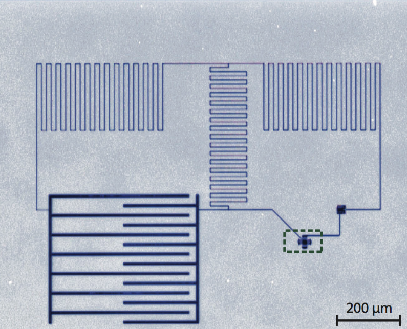{width=260 .center}
-->


<p align="center">
  
    <p align = "center">
        Inverted-colour optical micrograph of the circuit consisting of two coupled LC resonators, one having a mechanically com- pliant capacitor (Toth et. al. 2017).
    </p>
</p>


in the first example we illustrate how to simulate a hot microwave resonator. Here the temperature of the bath is higher than the temperature of the drive and therefore we expect to see an emission shaped like a Lorentzian. <!--To see the fool written example, go to [Simple cavity example](http://localhost:8888/notebooks/IOpy/iopy/examples/Simple%20Cavity.ipynb).-->

Let's start by defining the cavity mode

```python
omega_c = 5e9*np.pi*2
a = Mode('a', omega_c)
```

Then we have to define input fields. In this example the cavity is driven by a coherent drive and it is coupled to a thermal bath.

```python
kappa_ex = 0.2e6*np.pi*2
kappa_0 = 0.3e6*np.pi*2
kappa = kappa_ex + kappa_0

T_drive = 2e-5
T_bath = 10e-3

a_inex = Input('ex', a, kappa_ex, kind = 'drive',
                omega_drive = omega_c, bath_temp=T_drive)
a_in0 = Input('0', a, kappa_0, kind = 'bath', bath_temp=T_bath)
```

And finally we define the system object and the output field.

```python
sys_cav = System([a], [a_in0,  a_inex], [])
```
```python
a_outex = Output(sys_cav, a_inex)
```

Now for measuring the spectrum of the output field, we have to use the `spectrum` function.

```python
omegas = np.linspace(omega_c - 15*kappa, omega_c + 15*kappa, 1001)
spec = me.spectrum(omegas, me.PowerMeasurement(a_outex),
                   components = False, plot = True)
```

<!--
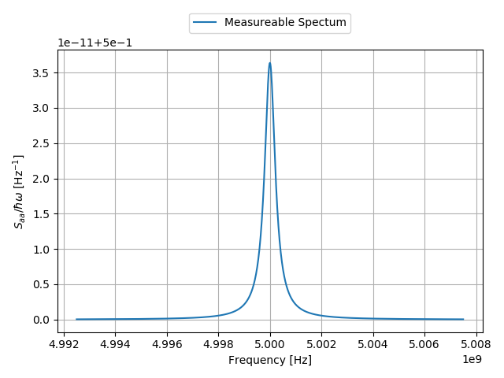{width=460 .center}
\begin{figure}[!h]
\caption{Simple cavity output spectrum}
\end{figure}
-->


<p align="center">
  
    <p align = "center">
        Simple cavity output spectrum
    </p>
</p>


As we expect, we can see a Lorentzian in the spectrum. If the temperature of the driving field was higher than the thermal bath, we would see a deep instead of a peak.

The linear response of the system to driving can also be measured with the `linear_response` function

```python
omegas_newex, S_ex = me.linear_response(omegas, sys_cav, a_outex,
                                        a_inex, plot = 1)
```

<!--
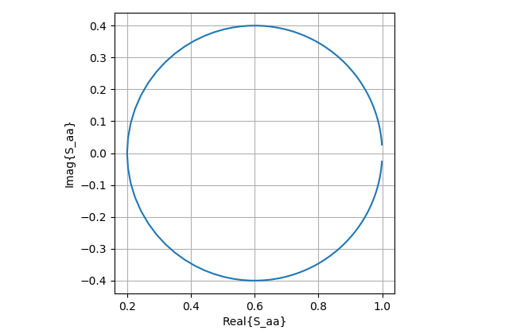{width=460 .center}
\begin{figure}[!h]
\caption{Cavity linear response in complex space}
\end{figure}

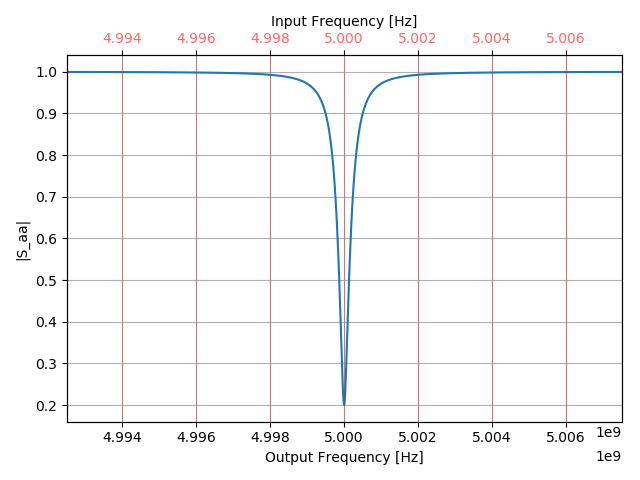{width=460 .center}
\begin{figure}[!h]
\caption{Cavity linear response amplitude}
\end{figure}

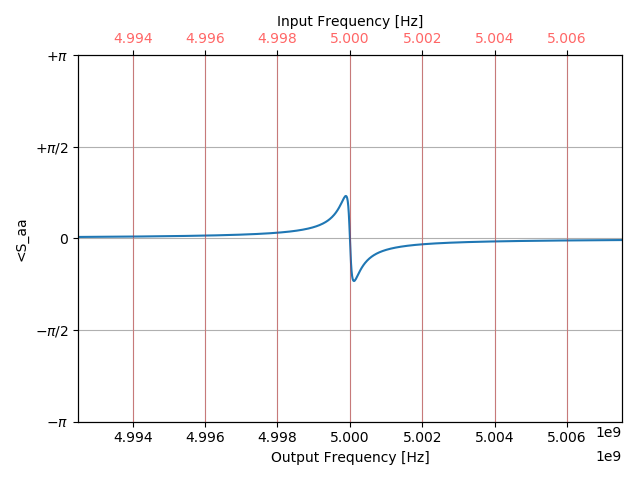{width=460 .center}
\begin{figure}[!h]
\caption{Cavity linear response phase}
\end{figure}
-->

<p align="center">
  
    <p align = "center">
        Cavity linear response in complex space
    </p>
</p>

<p align="center">
  
  <p align = "center">
        Cavity linear response amplitude
  </p>
</p>
<p align="center">
  
  <p align = "center">
        Cavity linear response phase
  </p>
</p>


The results can also be compared to the theory. For example in this case the linear response of the system to the drive field is

$$ S_{aa} = 1 - \frac{\kappa_{ex}}{\frac{\kappa}{2} - i(\omega-\omega_c)}.$$

The graphs below show the comparison between this equation and IOpy results.

<!--
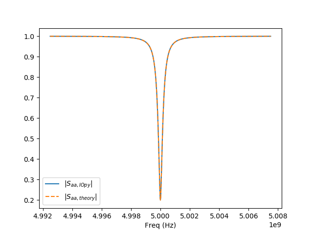{width=460 .center}
\begin{figure}[!h]
\caption{Cvity linear response amplitude calculated by theory (dashed) and IOpy (blue)}
\end{figure}

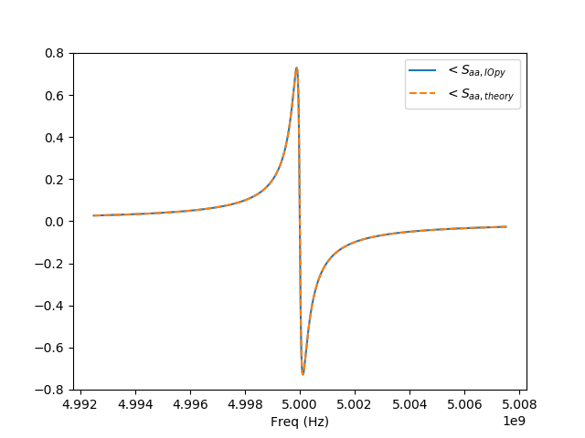{width=460 .center}
\begin{figure}[!h]
\caption{Cvity linear response phase calculated by theory (dashed) and IOpy (blue)}
\end{figure}
-->

<p align="center">
  
  <p align = "center">
        Cavity linear response amplitude
  </p>
</p>
<p align="center">
  
  <p align = "center">
        Cavity linear response phase
  </p>
</p>


# Basic Optomechanics and Cooling
<!--
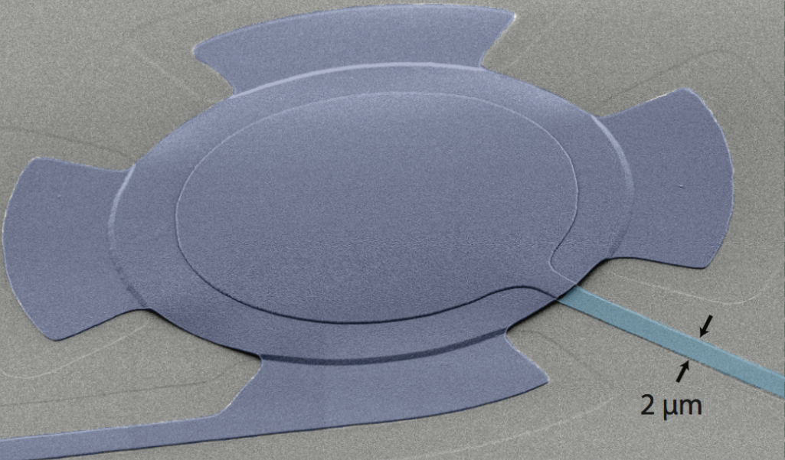{width=260 .center}
-->


<p align="center">
  
    <p align = "center">
        False-colour scanning electron micrograph of the mechanically compliant drum capacitor (Toth et. al. 2017).
    </p>
</p>

          
In this example we simulate an optomechanical system with a weak drive. Here we want to see the optomechanical cooling due to the increase in optomechanical damping rate. <!--To see the fool written example, go to [Basic optomechanics](http://localhost:8888/notebooks/IOpy/iopy/examples/Basic%20Optomechanics.ipynb).-->

In the basic optomechanical interaction, the cavity resonance frequency shifts by a constant value due to the DC nonlinearity. Therefore, before defining the modes we have to calculate this DC shift.

```python
omega_c = 5e9*np.pi*2     # cavity resonance frequency

kappa_0 = 0.3e6*np.pi*2
kappa_ex = 0.4e6*np.pi*2

kappa = kappa_0 + kappa_ex

omega_m = 5e6*np.pi*2    # mechanical resonance frequency
gamma_m = 100*np.pi*2

P_in = 5e-12

g_0 = 200*np.pi*2

omega_drive = omega_c - 1* omega_m


from DCnonlinearities import optomechanics

omdir = optomechanics(P_in, kappa_0, kappa_ex, omega_c,
                      omega_drive, omega_m, g_0)

g= omdir['g']  # optomechanical coupling rate = sqrt(nbar)*g_0
omega_c = omdir['omega_c']   # new cavity resonance frequency
```
Now we can define the modes, as well as input fields including thermal baths coupled to optics and mechanics and the optical driving field.

```python
a = Mode('a', omega_c)
b = Mode('b', omega_m)

a_inex = Input('ex', a, kappa_ex, kind = 'drive',
                omega_drive = omega_drive, bath_temp=10e-3)
a_in0 = Input('0', a, kappa_0, kind = 'bath', bath_temp=10e-3)

b_in0 = Input('0', b, gamma_m, kind = 'bath', bath_temp=10e-3)
```

Then we should define the coupling between the optical and mechanical modes:

```python
g_ab = Coupling(a, b, g * np.array([1,0,0,0]))
```
And finally we define the whole optomechanical system:

```python
sys_om = System([a, b], [a_in0,b_in0 , a_inex], [g_ab])
```

Now just like the previous example we can measure the spectrum of the output field.
<!--
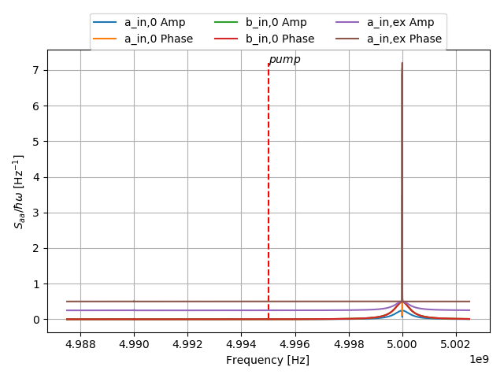{width=460 .center}
\begin{figure}[!h]
\caption{Optomechanical cavity output spectrum}
\end{figure}
-->

<p align="center">
  
    <p align = "center">
        Optomechanical cavity output spectrum
    </p>
</p>


The peak that can be seen is because of low sampling rate of the calculations. To have a better precision we zoom on the neighborhood of the cavity resonance frequency.

<!--
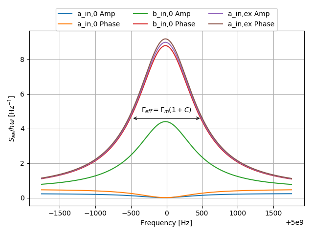{width=460 .center}
\begin{figure}[!h]
\caption{Optomechanical cavity output spectrum}
\end{figure}
-->

<p align="center">
  
    <p align = "center">
        Optomechanical cavity output spectrum
    </p>
</p>

Here we can clearly see different contributions to the spectrum. In addition the width of the spectrum is equal to the theory value $\Gamma_{\text{eff}} = \Gamma_m (1 + C)$ (with $C$ as the cooperativity equal to $\frac{4g^2}{\kappa\Gamma_m}$) which results in cooling.


# Strong Coupling Regime
<!--
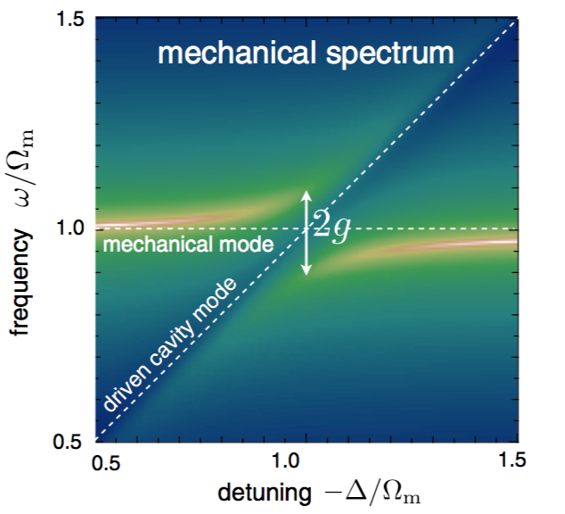{width=260 .center}
-->


<p align="center">
  
    <p align = "center">
        Mechanical frequency spectrum (frequency on vertical axis) as a function of laser detuning, for a strongly coupled optomechanical system. (Aspelmeyer, Kippenberg, Marquardt 2014)
    </p>
</p>


In this example we show the effect of increasing of the laser input power ($P_{\text{in}}$). For the details on the theory see [(Aspelmeyer, Kippenberg, Marquardt (2014))](https://journals.aps.org/rmp/abstract/10.1103/RevModPhys.86.1391), Section VII.C. By increasing the input power, at the beginning we can observe an improvement in the cooling, but as we continue increasing the power, the optical and mechanical modes hybridize to form two new modes with the eigenfrequencies

$$ \omega_{\pm} = \frac{\Omega_m-\Delta}{2} \pm \sqrt{g^2 + (\frac{\Omega_m+\Delta}{2})^2}.$$

When the driving laser is exactly detuned on the red sideband ($\Delta=-\Omega_m$) the splitting of these two modes is equal to $2g$. In this example we want to show this splitting on the spectrum.

To simulate this phenomenon, the code is exactly the same as the previous example but with a different input power.<!-- To see the full code go to [Strong coupling regime](http://localhost:8888/notebooks/IOpy/iopy/examples/Strong%20Coupling%20Regime.ipynb). -->

```python
P_in = 5e-9
```
By measuring the output filed spectrum we can clearly see this mode splitting.

<!--
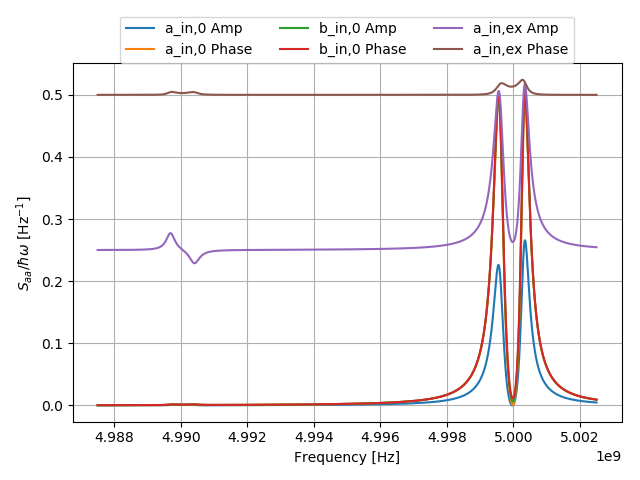{width=460 .center}
\begin{figure}[!h]
\caption{Optomechanical cavity output spectrum. One can see both red and blue sidebands of the pump.}
\end{figure}
-->

<p align="center">
  
    <p align = "center">
        Optomechanical cavity output spectrum. One can see both red and blue sidebands of the pump.
    </p>
</p>


To see better the splitting we change the measurement frequencies.

<!--
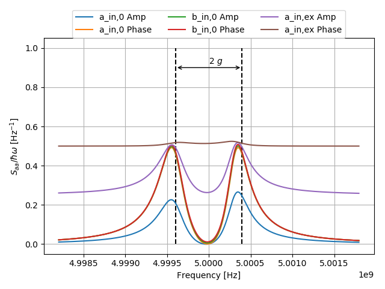{width=460 .center}
\begin{figure}[!h]
\caption{Optomechanical cavity output spectrum}
\end{figure}
-->

<p align="center">
  
    <p align = "center">
        Optomechanical cavity output spectrum
    </p>
</p>


# Optomechanically Induced Transparency
<!--
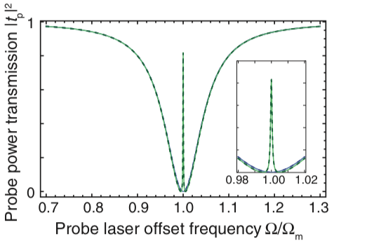{width=260 .center}
-->

<p align="center">
  
    <p align = "center">
        Transmission of the probe laser power through the optomechanical system in the case of a critically coupled cavity k0 = kex as a function of normalized probe laser frequency offset, when the control field is off (blue lines) and on (green lines) (Weis et al., 2010).
    </p>
</p>


This example is about the optomechanically induced transparency effect also known as OMIT. This effect was observed in atoms (electromagnetically induced transparency [Fleischhauer, Imamoglu, and Marangos, 2005](https://journals.aps.org/rmp/abstract/10.1103/RevModPhys.77.633)) as the cancellation of absorption in the presence of an auxiliary laser field. OMIT was predicted theoretically by Schliesser, 2009 and [Agarwal and Huang 2010](https://journals.aps.org/pra/abstract/10.1103/PhysRevA.81.041803). When the optical cavity is pumped on the red sideband and we inject a weak probe field into the cavity, the optomechanical interaction causes the cavity to be seen transparent by this weak field.

To simulate this phenomenan in IOpy, the setup is again similar to the basic optomechanics example. The difference here is that we set the driving field (control field, in this context) to be a high temperature source. In this way, the noise around this control field play the role of the weak probe field for us, so we can see the OMIT effect in the spectrum, as well as the linear response. <!--To see the full code go to [OMIT](http://localhost:8888/notebooks/IOpy/iopy/examples/OMIT.ipynb) example.-->

```python
T_cont = 1
T_bath = 10e-3

a_cont = Input('ex', a, kappa_ex, kind = 'drive',
               omega_drive = omega_cont, bath_temp = T_cont)
a_in0 = Input('0', a, kappa_0, kind = 'bath', bath_temp = T_bath)

b_in0 = Input('0', b, gamma_m, kind = 'bath', bath_temp = T_bath)
```

And now we measure the spectrum and the linear response.

<!--
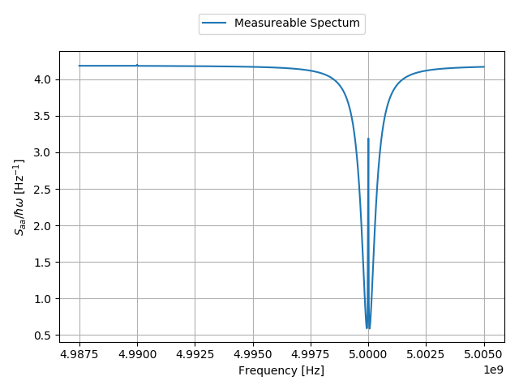{width=460 .center}
\begin{figure}[!h]
\caption{Optomechanical cavity output spectrum}
\end{figure}

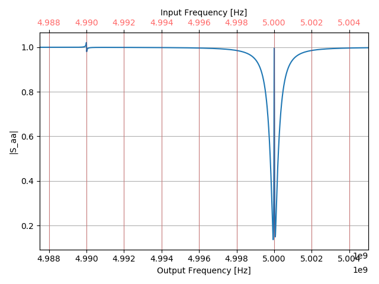{width=460 .center}
\begin{figure}[!h]
\caption{Optomechanical cavity linear response amplitude}
\end{figure}

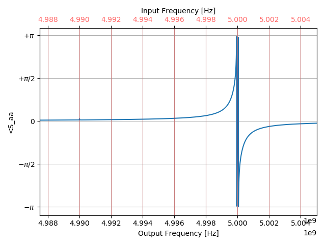{width=460 .center}
\begin{figure}[!h]
\caption{Optomechanical cavity linear response phase}
\end{figure}
-->


<p align="center">
  
    <p align = "center">
        Optomechanical cavity output spectrum
    </p>
</p>

<p align="center">
  
  <p align = "center">
        Optomechanical cavity linear response amplitude
  </p>
</p>

<p align="center">
  
  <p align = "center">
        Optomechanical cavity linear response phase
  </p>
</p>


These results can also be compared to theory. To see the details go to [OMIT Test](http://localhost:8888/notebooks/IOpy/iopy/Tests/OMIT%20Test.ipynb) notebook. We can show for the transmission window


$$T = 1 - \kappa_{\text{ext}}\frac{\chi_{\text{opt}}(\Omega)}{1 + g^2\chi_{\text{mech}}(\Omega)\chi_{\text{opt}}(\Omega)},$$

where

$$
    \chi_{\text{opt}}(\Omega) = [-i(\Omega+\Delta)+\kappa/2]^{-1},\\
    \chi_{\text{mech}}(\Omega) = [-i(\Omega-\Omega_m)+\Gamma_m/2]^{-1},
$$

with

$$\Delta = \omega_{\text{cont}} - \omega_{\text{cav}},\quad \Omega = \omega_p - \omega_{\text{cont}}.$$

And the linear response from IOpy can be compared with this results as shown in figures bellow.

<!--
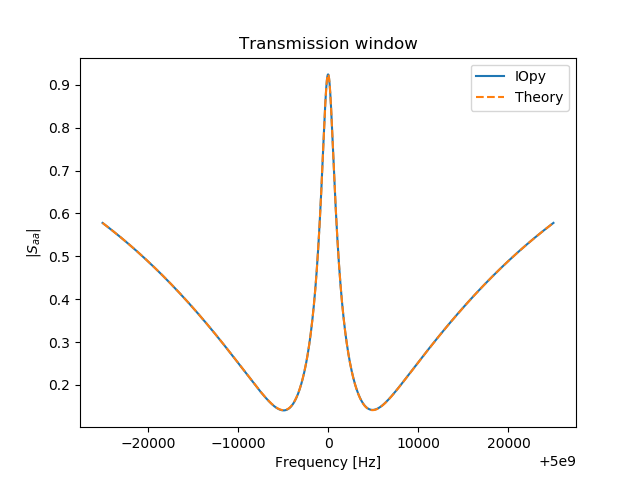{width=460 .center}
\begin{figure}[!h]
\caption{Optomechanical cavity linear response amplitude}
\end{figure}

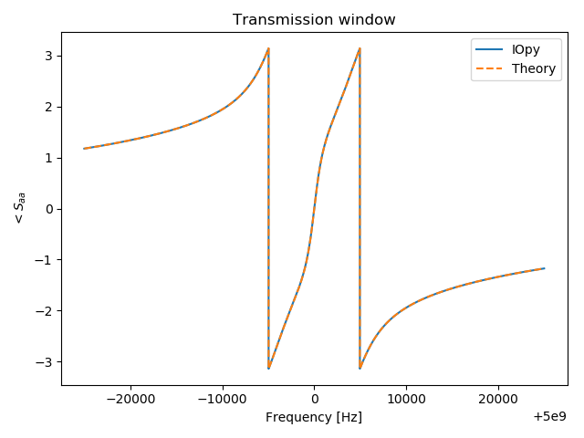{width=460 .center}
\begin{figure}[!h]
\caption{Optomechanical cavity linear response phase}
\end{figure}
-->


<p align="center">
  
  <p align = "center">
        Optomechanical cavity linear response amplitude
  </p>
</p>

<p align="center">
  
  <p align = "center">
        Optomechanical cavity linear response phase
  </p>
</p>


# Frequency Conversion Using OMIT
<!--
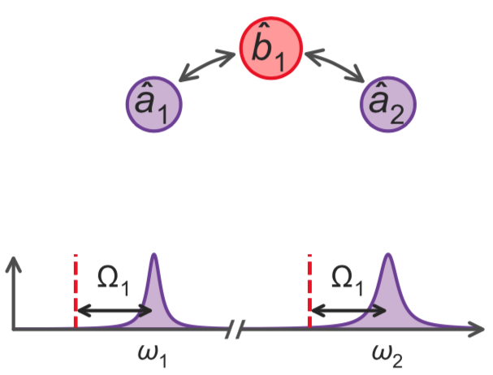{width=260 .center}
-->


<p align="center">
  
    <p align = "center">
        Reciprocal mechanically-mediated frequency conversion (adapted from Peterson et. al. 2018).
    </p>
</p>


The last example is about the frequency conversion using the OMIT effect which is a step towards multimode calculations. In this scenario, two optical modes with different resonance frequencies are coupled to the same mechanical mode and the optical modes are each pumped on their red sidebands. If we inject a weak probe to one of the cavities, there will be an emission from the other cavity. The qualitative explanation is that when probe field is on resonance with the first cavity, it will beat with the pump and excite the mechanics. the excitation of the mechanics then phase modulates the second pump which creates sidebands. To see this effect in IOpy first we have to define the whole system as two optical modes each with one drive, tuned on their red sidebands and coupled to a shared mechanical mode.<!-- To see the full code, go to [Frequency Conversion using OMIT](http://localhost:8888/notebooks/IOpy/iopy/examples/Frequency%20Conversion%20using%20OMIT.ipynb).-->

```python
omega_cav1 = 5e9*np.pi*2
kappa_01 = 0.3e6*np.pi*2
kappa_ex1 = 0.4e6*np.pi*2

omega_cav2 = 6e9*np.pi*2
kappa_02 = 0.3e6*np.pi*2
kappa_ex2 = 0.4e6*np.pi*2


omega_m = 5e6*np.pi*2
gamma_m = 100*np.pi*2

g_01 = 200*np.pi*2
g_02= 200*np.pi*2


P_in1 = 8e-10
Delta1 = -omega_m
omega_cont1 = omega_cav1 + Delta1
T_cont1 = 2
bath_temp1 = 10e-3

P_in2 = 8e-10
Delta2 = -omega_m
omega_cont2 = omega_cav2 + Delta2
T_cont2 = 2
bath_temp2 = 10e-3

from DCnonlinearities import optomechanics

omdir1 = optomechanics(P_in1, kappa_01, kappa_ex1,
                       omega_cav1, omega_cont1, omega_m, g_01)
g1= omdir1['g']
omega_cav1 = omdir1['omega_c']

omdir2 = optomechanics(P_in2, kappa_02, kappa_ex2,
                       omega_cav2, omega_cont2, omega_m, g_02)
g2= omdir2['g']
omega_cav2 = omdir2['omega_c']


a1 = Mode('a1', omega_cav1)
a2 = Mode('a2', omega_cav2)
b = Mode('b', omega_m)

a_cont1 = Input('ex', a1, kappa_ex1, kind = 'drive',
                omega_drive = omega_cont1, bath_temp = T_cont1)
a_in01 = Input('0', a1, kappa_01, kind = 'bath', bath_temp = bath_temp1)

a_cont2 = Input('ex', a2, kappa_ex2, kind = 'drive',
                omega_drive = omega_cont2, bath_temp = T_cont2)
a_in02 = Input('0', a2, kappa_02, kind = 'bath', bath_temp = bath_temp2)

b_in0 = Input('0', b, gamma_m, kind = 'bath', bath_temp=10e-3)

g_a1b = Coupling(a1, b, g1 * np.array([1,0,1,0]))
g_a2b = Coupling(a2, b, g2 * np.array([1,0,0,0]))

sys_om = System([a1, a2, b], [a_in01, a_in02, b_in0, a_cont1, a_cont2],
                [g_a1b, g_a2b])
```

Then we have to define the output ports and then measure the linear response from the input drives port of first cavity to the output port of the second cavity.

```python
a_outex1 = Output(sys_om, a_cont1)
a_outex2 = Output(sys_om, a_cont2)

omegas = np.linspace(omega_cav1 - 2.5* omega_m, omega_cav1 +  2.5 * omega_m, 10000)
omegas_new, A = me.linear_response(omegas, sys_om, a_outex2, a_cont1, plot = True)
```

And the result, which is a measure of the frequency conversion efficiency, can be seen in the graph below.

<!--
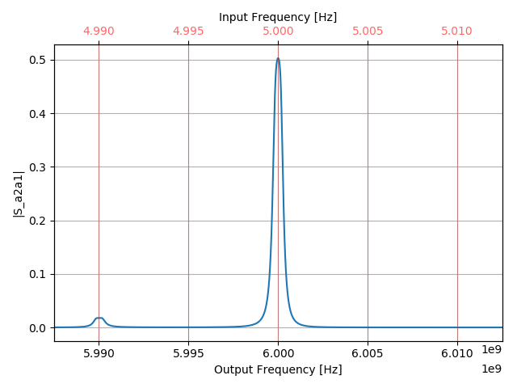{width=460 .center}
\begin{figure}[!h]
\caption{Frequency conversion linear response amplitude}
\end{figure}
-->


<p align="center">
  
  <p align = "center">
        Frequency conversion linear response amplitude
  </p>
</p>


Both the input field and output field frequencies are shown on the graph. This means every point on this curve is the amplitude of the output field at the "output frequency", when the input probe is at the corresponding "input frequency".
