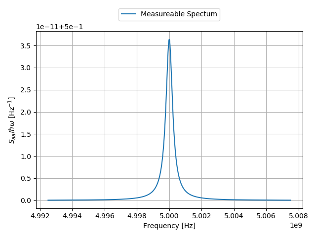

# What is IOpy?

IOpy is a python-based package for solving the equations of motion of coupled oscillators which are in contact with thermal baths. These equations which are in the form of Langevin equations (or quantum Langevin equations in quantum limit) appear in many research areas in physics. Specifically, in optomechanics, which is the study of interaction of light with mechanical oscillators, this problem forms the essence of the theory. Finding the solutions of Langevin equations in different optomechanical system can result in discovering novel phenomena. However, the procedure to find these solutions is similar in most of the cases ([input-output formalism](http://127.0.0.1:8000/theory/#input-output-formalism), which the name IOpy is also coming from) and the essential difference between them is the difference between the physical setups. Moreover, in complex setups the calculations for finding the solutions can be really hard and tedious to do by hand (for example inverting matrices with large dimensions).

On the other hand, in many problems in optomechanics there are a lot of physical phenomena which are involved in the dynamics. For newcomers in the field, like students who want to learn optomechanics, it can be confusing for them to distinguish different effects of different physical phenomena involved in the dynamics. Looking for a solution to resolve the two mentioned issues was the motivation for writing this code.

With IOpy, you can define your physical setup very fast and without the need for going through the details. Further more you can visualise the results in a way which can help people to test their theoretical results and also help newcomers to grasp the elements of the optomechanics. For example to see the emission spectrum of a hot optical resonator you can define your optical mode in a single line:

```python
a = Mode(name = 'a', omega = 5e9 *2*np.pi)
```

And then defining the thermal bath and the driving field each in a single line:

```python
a_inex = Input(name = 'ex', a, kappa = 0.2e6 *2*np.pi,
               kind = 'drive', omega_drive = 5e9 *2*np.pi,
               bath_temp = 2e-5)
a_in0 = Input('0', a, kappa = 0.3e6 *2*np.pi, kind = 'bath',
              bath_temp = 10e-3)
```

And finally defining the system, output port and the spectrum:

```python
sys_cav = System([a], [a_in0,  a_inex], [])
a_outex = Output(sys_cav, a_inex)
spec = me.spectrum(omegas, me.PowerMeasurement(a_outex),
                   components = False, plot = True)
```
And the result would be:
<!--
{width=460 .center}
\begin{figure}[!h]
\caption{Simple cavity output spectrum}
\end{figure}
-->
<p align="center">
  
</p>


A more detailed explanation of this example as well as more examples for optomechanics are availabe on the [Examples](http://127.0.0.1:8000/Examples/) page.

# Structure of IOpy
IOpy consists out of four scripts which each serving a special purpose:

`elements`: For defining different components of the physical system (modes, couplings, input-output fields and the system)

`DCnonlinearities`: For calculation of DC shifts in the system variables due to nonlinear effects.

`measurement`: For calculating linear responses and power spectral densities.

`plots`: For visualising the measurements' results in graphs.

# Installation

<!--
## Comments of Nick
In general I would try to make a story around these two usecases.
IOpy aims for:
* testing and visulizing of theorectical models 
* being an educational tool to learn about the classical effects in optomechanics 
As an eyecatcher, it maybe makes sense to show a very short example of IOpy on the about page. (You can use the simple cavity example. But don't add a lot of explanation. This you will do in the examples section)
Usually people (including me =) ) that want to use the software for the first time, just look at the first page to start.
Also try to make a short comment about the structure of IOpy. What are the important files? And link to the section that gives a more detailed description.
At the end you should have some links to installation and further examples.
Installation:
git pull
and also name all the packages that have to installed to use iopy:
numpy, scipy, matplotlib (These are all the classics)
-->