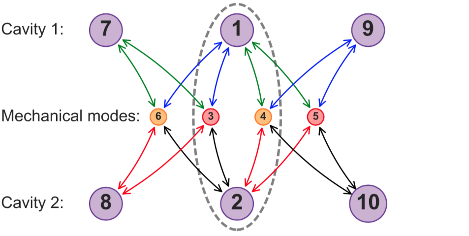
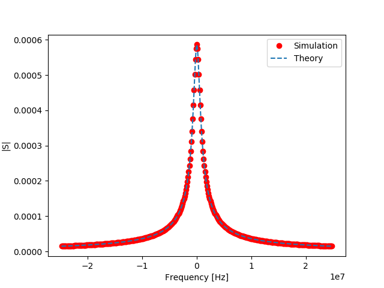
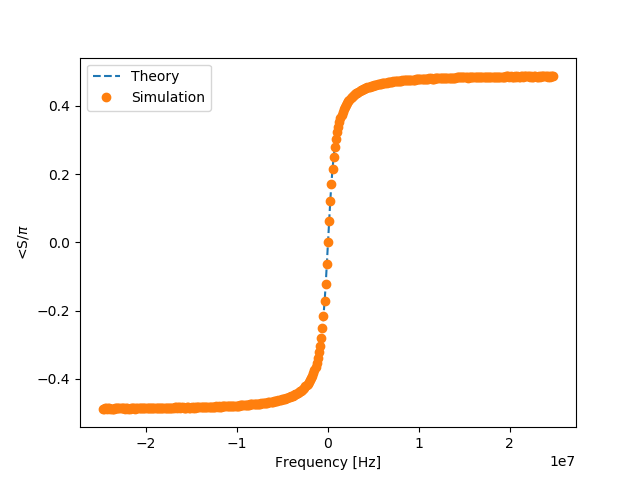

This section is dedicated to our perspective for the future of IOpy. 

# Multimode optomechanics
One of the biggest motivations for starting the IOpy project was to develope a computational tool to help the experts in the field with the theoretical calculations. When the optomechanical systems become more complex the calculations also get more complicated and even impossible to be done by hand without approximations. Specially, when the system invloves more oscillating modes including optical cavities, mechanical oscillators or driving fields. Multimode optomechanics which is a growing field in this context can be elevated if such computational tools has the power to do the multimode calculations with an acceptable accuracy. But the barrier for the IOpy to do these calculations is arising from almost the same issue when we want to drive an optical mode with more than one pump.

## Multidrive issue
In many experiments in optomechanics we need to drive optical resonators with more than one pump field. In this case the theoretical calculations are not as clear as the simple case where each optical mode is driven by a single pump. The complexity is arising from the fact that due to the nonlinear nature of the optomechanical interaction, there would always be frequency mixing terms in the dynamics. In case of a single pump these mixings can be divided into fast and slowly varying terms and by going to the rotating frame of the drive, the equations of motions for the slowly varying terms become time independent and with linearizing the equations in principle they can be solved exactly in the frequency domain. But in case of multiple drives, because of the presence of multiple powerfull tones in general it's impossible to apply the same idea and equations of motion can not become time indipendent. In another language, there no longer exists a single rotating frame that every other time variation can be considered slowly variying. The idea of having different rotating frames also fails because of the nonlinearities that prevents two rotating frames to be independent of each other.

However, there are some approaches to resolve the problem still in frequency domain. For example one solution is to use the Floquet ansatz to expand the variables by a Fourier series with principle frequency equal to difference frequency of the two drives (see [Malz and Nunnenkamp, 2016](https://journals.aps.org/pra/abstract/10.1103/PhysRevA.94.023803)). As another example, in the context of four-mode isolator, where again each optical cavity is pumped with two drives to be coupled to two different mechanical modes, the idea is to define the higher order mixing terms as "auxiliary modes" and expand the model to a model with higher number of modes as shown in the picture below from the work of [Peterson et. al., 2018](https://journals.aps.org/prx/abstract/10.1103/PhysRevX.7.031001).

<!--
{width=460 .center}
\begin{figure}[!h]
\caption{The idea of the expanded mode basis for the four-mode isolator}
\end{figure}
-->

  
    

        The idea of the expanded mode basis for the four-mode isolator (Peterson et. al., 2018)
    

But in both cases, the calculations rely on truncating an infinite series and using the approximations like rotating wave approximation which we are intended to avoid in IOpy for keeping the calculations general. Moreover, these ideas will result into huge complexity in case of more than two drives.

## Time domain simulations
These issues lead us to think about a totally different approach for the calculations which is adopted from what is really happening in the experiments. In experiments, a VNA measures the scattering matrix of a network in this way that it injects a coherent signal (a sine wave) to the network and extracts the amplitude and phase from the output of the network. This, we can exactly do with time-domain simulations. In principle we can write the most general Hamiltonian of the optomechanical network as:

$$H_{sys} = \sum_k \hbar\omega_{cav,k}a^{\dagger}_ka_k + \sum_j \hbar\Omega_jb^{\dagger}_jb_j -\hbar\sum_{j,k,l}[g_0]_{kl}^ja^\dagger_ka_l(b^\dagger_j+b_j)$$
$$H_{drive} = \sum_{j,m}i\hbar\sqrt{\kappa_{jm}}(s_{in,jm}(t)a^\dagger_je^{-i\omega_mt} + H.c.)$$

With this, we can derive the equations of motion in the time domain and we can define the output ports with the input-output theory as $s_{out,jm} = s_{in,jm} - \sqrt{\kappa_{jm}}a_j$. Then for calculating the scattering matrix we can simulate the equations of motion in the time domain for inputs as sine waves, spanning a frequency band. Then look at the Fourier transform of the output wave at the frequencies we are interested to extract the amplitude and phase of the response. Once the scattering matrix is calculated, every other parameter like the spectrum can be calculated. 

This simulation is done for a simple case of a simple cavity. To see the full code go to [TimeDomain - SimpleCavity](http://localhost:8888/notebooks/IOpy/iopy/Time%20Domain/TimeDomain%20-%20SimpleCavity.ipynb). The results for this simulation are shown in the figures below:

<!--
{width=460 .center}
\begin{figure}[!h]
\caption{the amplitude of the linear response calculated with time domain simulation}
\end{figure}

{width=460 .center}
\begin{figure}[!h]
\caption{the amplitude of the linear response calculated with time domain simulation}
\end{figure}
-->

  
    

        the amplitude of the linear response calculated with time domain simulation
    

  
    

        the phase of the linear response calculated with time domain simulation
    

Althogh this idea works for the simple cavity, but for more complex systems like the basic optomechanics, it still requires investment of time as well as time domain simulations skills. Developing a time domian calculation library for the IOpy is one of the main goals of the future for it.

# Beyond optomechanics

Another future goal for IOpy is to use it for physical systems other than optomechanics. In IOpy calculations, the physical nature of the problem is not really taken into account. For example all of the examples given so far are in microwave domain (for superconducting circuit optomechanics) but all of them can also be implemented for the optical domain. In principle, we can go even further. As it can be inferred from the package name, every phenomena which deals with coupled oscillators and can be formulated in input-output formalism can in principle be simulated using it (IO in IOpy stands for Input-Output). 